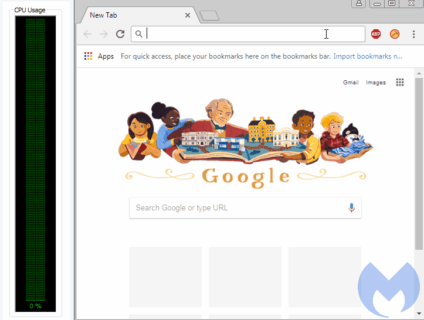

# Actividad individual 2: Vectores de ataque

Hola soy Johanna Yépez, aquí encontrarás información relacionada a un ciberdelito. En este caso: **Cryptojacking**

- **Un poco de teoría** *Optional*
    - Articulo de Kaspersky: https://latam.kaspersky.com/resource-center/definitions/what-is-cryptojacking
    - Articulo de la Interpol: https://www.interpol.int/es/Delitos/Ciberdelincuencia/Cryptojacking
        - *ver pdf adjunto* 
        
- **¿Como se realiza o Como funciona?**
    - En este blog se detalla paso a paso un Caso de Uso Detectando y deteniendo el Cryptojacking
        - https://logrhythm.com/blog/insider-threat-use-case-detecting-and-stopping-cryptojacking/

    - De la misma forma en este blog se habla de ello
        - https://steemit.com/coinhivealternatives/@sugitv/cryptojackingtutorial-jx2vu8h2xu

    - En este video Computerphile explica de forma practica el Funcionamiento de Cryptojacking mientras hace un ejemplo en su computador
        - https://www.youtube.com/watch?v=vMIZKtVruH8
    
    - En este simposio en vivo Matt Benyo habla sobre el Arte del Cryptojacking y su funcionamiento con una explicación gráfica
        - https://www.youtube.com/watch?v=LppxJQ9dKPo

    - Aquí tenemos un video del funcionamiento de CoinHive uno de los más populares con el cual es posible ejecutar una operación de Minería a través de JavaScript en su sitio web. Actualmente ya no se encuentra en funcionamiento
        - https://www.youtube.com/watch?v=knrOWgYi8vg

    - Video sobre la inyección del Minador CoinHive en una red Wifi Pública
        - https://www.youtube.com/watch?v=oXsSTMi5lZ0

- **Reportajes y Noticias**
    - Detected Cryptojacking Prompts Microsoft. Se detectó cerca de 8 apps en Microsoft Store que identificaron la presencia de un código subrepticio de minería de monedas Monero (XMR). 
        - https://cointelegraph.com/news/detected-cryptojacking-prompts-microsoft-to-remove-eight-free-apps-from-microsoft-store

    - Un reportaje acerca del estado de la criptominería maliciosa
        - https://www.malwarebytes.com/blog/news/2018/02/state-malicious-cryptomining?_gl=1*p6t6s*_gcl_au*NjAwMjY2NTIuMTcxODU4OTg4Nw..*_ga*MTE1MzA4MTM5OC4xNzE4NTg5ODg3*_ga_K8KCHE3KSC*MTcxODU4OTg4Ny4xLjAuMTcxODU4OTg4Ny42MC4wLjA.&_ga=2.115658438.1182362623.1718589887-1153081398.1718589887

    - Otro reportaje realizado por Malwarebytes acerca de la Criptominería maliciosa y el enigma de la lista negra
        - https://www.malwarebytes.com/blog/news/2018/03/malicious-cryptomining-and-the-blacklist-conundrum?_gl=1*p6t6s*_gcl_au*NjAwMjY2NTIuMTcxODU4OTg4Nw..*_ga*MTE1MzA4MTM5OC4xNzE4NTg5ODg3*_ga_K8KCHE3KSC*MTcxODU4OTg4Ny4xLjAuMTcxODU4OTg4Ny42MC4wLjA.&_ga=2.115658438.1182362623.1718589887-1153081398.1718589887

- **Artículos Científicos**
    - Publicación en la IEEE acerca de SoK: Cryptojacking Malware previamente mencionado y algunas técnicas de ello
        - https://ieeexplore.ieee.org/document/9581251

- **Scripts y Herramientas**
    - Código Fuente de Monero-injector un script automatizado simple que inyecta xmrig miner en sistemas basados ​​en Debian como un servicio del sistema y persiste durante los reinicios.
        - https://github.com/shadowctrl/crypto-miner

    - Este repositorio contiene el conjunto de datos de malware de criptojacking
        - https://github.com/sokcryptojacking/SoK

    - Servicio que ofrece Cryptojacking a cambio de Monero (XMR)
        - https://crypto-loot.com/index.php
    
    - Código Coinhive, un popular script de criptojacking, sirve como un excelente ejemplo de cómo el cryptojacking puede afectar a los usuarios desprevenidos.
        - https://github.com/cazala/coin-hive
        - Dentro de este repositorio nos encontramos con las siguientes líneas de código que se insertaba en un Website donde puedo identificar cierta información de la que se habla en los videos mostrados previamente
```js
const CoinHive = require('coin-hive');

(async () => {
  // Creación de la minería
  const miner = await CoinHive('ZM4gjqQ0jh0jbZ3tZDByOXAjyotDbo00'); // Llaves de CoinHive

  // Iniciar Minado
  await miner.start();

  // Escuchar los eventos
  miner.on('found', () => console.log('Found!'));  //Evento Encontrado
  miner.on('accepted', () => console.log('Accepted!'));  //Evento Aceptado
  miner.on('update', data =>   //Actualizar Hash encontrados
    console.log(`
    Hashes per second: ${data.hashesPerSecond}
    Total hashes: ${data.totalHashes}
    Accepted hashes: ${data.acceptedHashes}
  `)
  );

  // Parar el minado
  setTimeout(async () => await miner.stop(), 60000);
})();
```
        -   Cuando un usuario visitaba el sitio web que contenía el script de CoinHive, el código JavaScript se ejecutaba automáticamente en el navegador del usuario.
        
       

        - A medida que los cálculos se realizaban, contribuían a la resolución de bloques en la blockchain de Monero. Si se resolvía un bloque exitosamente, se generaba una cantidad de Monero como recompensa.
        - La criptomoneda minada se dividía entre el propietario del sitio web y CoinHive, generalmente con una comisión tomada por CoinHive por proporcionar la plataforma.
